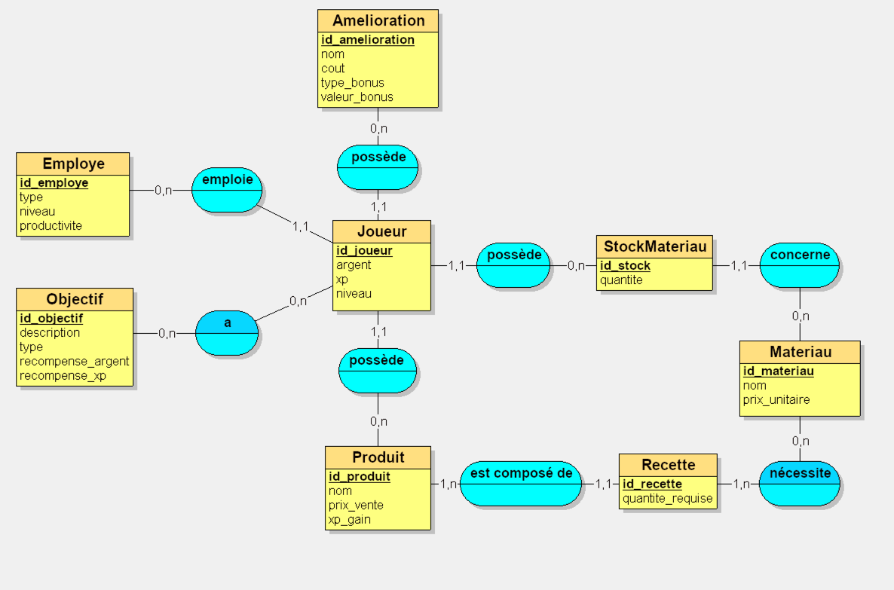

<div align="center">

# Manu’Fact
## Documentation Technique

### Serious Game de gestion d’entreprise

**Développé avec Unity 6 (6000.3.3f1)**  
**Plateforme cible : Android**

#### 16 mars 2026


#### SCHMID Mathilde - Master M2I

</div>

## Sommaire

- [1. Présentation du projet](#1-présentation-du-projet)
  - [1.1. Concept](#11-concept)
  - [1.2. Objectifs pédagogiques](#12-objectifs-pédagogiques)
  - [1.3. Technologies utilisées](#13-technologies-utilisées)
- [2. Architecture du projet](#2-architecture-du-projet)
  - [2.1. Organisation des fichiers (Assets/Scripts)](#21-organisation-exacte-des-fichiers-assetsscripts)
  - [2.2. Design patterns utilisés](#22-design-patterns-utilisés)
- [3. Scripts principaux](#3-scripts-principaux)
- [4. Interface utilisateur](#4-interface-utilisateur)
  - [4.1. Schéma de navigation](#41-schéma-de-navigation)
  - [4.2. MainMenu.cs - Menu Principal](#42-mainmenucs---menu-principal)
- [5. Effets visuels et sonores](#5-effets-visuels-et-sonores)
  - [5.1. Effets visuels](#51-effets-visuels)
  - [5.2. Musiques](#52-musiques)
  - [5.3. Effets sonores (SFX)](#53-effets-sonores-sfx)
- [6. Données](#6-données)
  - [6.1. Architecture de la sauvegarde locale](#61-architecture-de-la-sauvegarde-locale)
  - [6.2. Comportement général](#62-comportement-général)
  - [6.3. Exemple des clés PlayerPrefs utilisées](#63-exemple-des-clés-playerprefs-utilisées)
- [7. Déploiements](#7-déploiements)
  - [7.1. Build Android](#71-build-android)
  - [7.2. Prérequis](#72-prérequis)
  - [7.3. Évolutions prévues](#73-évolutions-prévues)
- [8. Diagramme de classes](#8-diagramme-de-classes)
- [9. Diagramme de flux](#9-diagramme-de-flux)
- [10. MCD (Modèle Conceptuel de Données)](#10-mcd-modèle-conceptuel-de-données)


## 1. Présentation du projet

### 1.1. Concept
Manu’Fact est un Serious Game mobile développé en 2D avec Unity. 
Le joueur incarne un artisan menuisier et doit gérer une entreprise artisanale en réalisant différentes actions :
- Achat de matériaux
- Fabrication de produits (meubles)
- Vente de meubles
- Améliorations de l’atelier

Le jeu repose sur une boucle économique pédagogique permettant au joueur d'apprendre les bases de la gestion d’entreprise : acheter au bon prix, investir dans l’atelier, fabriquer et vendre pour dégager de la marge, et planifier les évolutions.

### 1.2. Objectifs pédagogiques
Le jeu vise à permettre au joueur de :
- Comprendre la gestion d’un budget (revenus / dépenses)
- Optimiser l’utilisation des ressources
- Prendre des décisions stratégiques (court terme vs long terme)
- Comprendre la notion de rentabilité et d’investissement
- Planifier ses actions dans le temps

### 1.3. Technologies utilisées

| Technologie | Usage |
|---|---|
| Unity (version recommandée par le projet) | Moteur de jeu (2D) |
| C# | Langage de programmation (Mono / .NET utilisé par Unity) |
| Firebase Firestore | Sauvegarde distante / backup des parties, analytics |
| Firebase Auth | Authentification anonyme / gestion d’utilisateurs |
| TextMeshPro | Rendu de texte avancé (UI) |
| PlayerPrefs | Sauvegarde locale simple (paramètres, variables clés) |
| Unity UI | Interface utilisateur (Canvas, boutons, panels) |
| JSON | Sérialisation des données de sauvegarde |

Remarques :
- Le projet contient des scripts d'intégration Firebase (`Assets/Scripts/Firebase/*`) et un `SaveManager` qui utilise PlayerPrefs pour des valeurs clés (voir `Assets/Scripts/Core/SaveManager.cs`).

---

## 2. Architecture du projet

### 2.1. Organisation des fichiers 

Le projet suit une architecture modulaire avec séparation des responsabilités :

- Assets/
  - Scripts/
    - Core/                 # logique métier (managers, orchestrateurs)
      - AudioManager.cs
      - BoosterManager.cs
      - BuildingManager.cs
      - ComboManager.cs
      - DailyRewardManager.cs
      - EmployeeManager.cs
      - EventManager.cs
      - FeedbackManager.cs
      - GameManager.cs
      - MenuManager.cs
      - NameInputManager.cs
      - NotificationManager.cs
      - ObjectiveManager.cs
      - OrderManager.cs
      - ProgressionManager.cs
      - RecipeUnlockManager.cs
      - SaveManager.cs
      - SceneNavigator.cs
      - StatsManager.cs
      - TabManager.cs
      - TimeManager.cs
      - TutorialManager.cs
    - Data/                 # modèles de données 
      - CraftingMaterial.cs
      - Employee.cs
      - GameEvent.cs
      - Objective.cs
      - Order.cs
      - Product.cs
      - StatsData.cs
      - Upgrade.cs
    - Firebase/             # intégration backend (Firestore, Auth, helpers)
      - FirebaseManager.cs
      - FirebaseMenuIntegration.cs
      - FirebaseSaveManager.cs
      - FirebaseTestSetup.cs
      - FirebaseUIExamples.cs
      - GameManagerFirebaseIntegration.cs
    - UI/                   # composants d'interface (panels, item UI, animations)
      - BadgePulse.cs
      - BuildingUI.cs
      - ButtonAnimator.cs
      - DailyRewardUI.cs
      - EmployeeItemUI.cs
      - EmployeesUI.cs
      - EventPopupUI.cs
      - FloatingText.cs
      - MaterialItemUI.cs
      - NameInputPanel.cs
      - NotificationBadge.cs
      - ObjectiveItemUI.cs
      - ObjectivesPanelToggle.cs
      - OrderItemUI.cs
      - OrdersUI.cs
      - ProductItemUI.cs
      - SaleItemUI.cs
      - SimpleUIAnimations.cs
      - StatsUI.cs
      - UIButtonSound.cs
      - UpgradeItemUI.cs

### 2.2. Design patterns utilisés
- Singleton (pour managers globaux persistants : `GameManager`, `AudioManager`, `SaveManager`, etc.).
- Observer / Event pour la communication entre systèmes (`EventManager` et events C# internes).
- Repository / Service Layer pour l'accès à Firestore (`FirebaseSaveManager`, `FirebaseManager`).
- State pattern pour l'état de jeu géré par `GameManager`.

---

## 3. Scripts principaux

#### GameManager - Logique centrale

- Gère l'état global du jeu (démarrage, pause, reprise, fin).
- Initialise et référence les autres managers.
- Ordonne les sauvegardes et les transitions de scènes.
- Fait le lien entre l'entrée utilisateur et la logique métier.

#### AudioManager - Gestion audio

- Gère la lecture des musiques (BGM) et des SFX.
- Gère les volumes master/music/sfx et persistances (PlayerPrefs).
- Fournit des méthodes publiques pour jouer/stopper la musique et jouer des SFX.
- Utilise un pool d'AudioSource pour optimiser les SFX courts.

#### BoosterManager - Gestion des boosters/bonus temporaires

- Gère l'activation et la durée des boosters.
- Applique les modificateurs (vitesse, revenus) aux systèmes concernés.
- Émet des événements quand un booster commence / se termine.

#### BuildingManager - Gestion des bâtiments / ateliers

- Maintient l'état des bâtiments (niveau, capacité).
- Applique les améliorations et leurs effets.
- Fournit des API pour interroger/mettre à jour l'état des bâtiments.

#### ComboManager - Gestion des combos/bonus en chaîne

- Suit les enchaînements d'actions du joueur pour détecter des combos.
- Calcule et applique les bonus associés aux combos.
- Réinitialise le compteur selon des timers/délais.

#### DailyRewardManager - Récompenses quotidiennes

- Vérifie l'éligibilité aux récompenses journalières.
- Gère la logique de collection et la réinitialisation quotidienne.
- Persiste l'état (dernier jour collecté) via PlayerPrefs ou SaveManager.

#### EmployeeManager - Gestion du personnel

- Gère la liste des employés, leurs stats et niveaux.
- Calcule l'impact des employés sur la production.
- Gère les coûts (salaires) et l'assignation aux postes.

#### EventManager - Gestion des événements

- Orchestre les événements globaux (promo, event limité).
- Diffuse les notifications / triggers aux autres systèmes.
- Permet d'enregistrer de nouveaux types d'événements dynamiquement.

#### FeedbackManager - Feedback visuel / haptique

- Centralise les retours visuels (FloatingText, animations) et sonores.
- Fournit des API pour afficher des toasts / messages temporaires.
- Peut déclencher des vibrations/feedback plateforme si disponible.

#### MenuManager - Gestion des menus

- Contrôle l'ouverture/fermeture des menus et panels.
- Gère les transitions entre menu principal et jeu.
- Peut stocker l'état des menus (last opened tab, etc.).

#### NameInputManager - Gestion du choix du nom du joueur

- Gère la saisie et validation du nom via l'UI.
- Persiste le nom choisi dans PlayerPrefs ou SaveManager.
- Affiche des erreurs/contraintes si le nom n'est pas valide.

#### NotificationManager - Notifications locales / badges

- Gère l'affichage des notifications in-game et des badges.
- Suit les compteurs non lus et met à jour les badges UI.
- Permet la planification/queue des notifications.

#### ObjectiveManager - Gestion des objectifs

- Suit la liste des objectifs et leurs conditions de complétion.
- Remet les récompenses quand un objectif est complété.
- Notifie l'UI et les systèmes de progression.

#### OrderManager - Gestion des commandes client

- Crée et suit la file de commandes (orders).
- Gère l'acceptation, le suivi et la livraison des commandes.
- Calcule les récompenses et pénalités liées aux commandes.

#### ProgressionManager - Gestion de la progression globale

- Suit l'XP, le niveau du joueur et les paliers.
- Déclenche le déblocage d'éléments liés à la progression.
- Expose des API pour ajouter XP et vérifier paliers.

#### RecipeUnlockManager - Déverrouillage des recettes

- Gère les conditions et l'application de déverrouillage des recettes.
- Notifie l'UI et met à jour l'état des produits disponibles.

#### SaveManager - Sauvegarde et chargement

- Sérialise les données clés et gère Save/Load/Reset.
- Utilise PlayerPrefs pour des valeurs simples et des clés nommées.
- Gère la migration des versions de sauvegarde si nécessaire.

#### SceneNavigator - Navigation / gestion de scènes

- Encapsule les transitions de scène et le chargement asynchrone.
- Offre des callbacks pour la fin de chargement et l'initialisation.
- Peut maintenir un historique de navigation si nécessaire.

#### StatsManager - Statistiques de jeu

- Agrège et expose les statistiques du joueur (argent total, produits craftés, etc.).
- Persiste / transmet les stats pour analytics ou affichage UI.

#### TabManager - Gestion des onglets d'UI

- Contrôle la logique d'onglets au sein d'un écran.
- Gère la persistance du dernier onglet sélectionné.

#### TimeManager - Gestion du temps du jeu

- Gère le temps en jeu (jours, heures) et les timers système.
- Gère la pause / reprise du temps et les ticks d'événements.

#### TutorialManager - Gestion du tutoriel

- Ordonne les étapes du tutoriel et vérifie la complétion.
- Verrouille/déverrouille l'accès aux fonctionnalités selon l'avancement.
- Sauvegarde l'état du tutoriel pour reprise.

---

## 4. Interface utilisateur

### 4.1. Schéma de navigation

Menu Principal - Atelier
               - Fabrication
               - Vente
               - Améliorations
               - Statistiques
               - Menuiserie
            

### 4.2. MainMenu.cs - Menu Principal
- Bouton "Continuer" : reprend la partie acutelle
- Bouton "Recommencer" : nouvelle partie
- Bouton "Paramètre" : gestion du son de la musique et des SFX
- Animations d’entrée : animations du titre et des boutons

## 5. Effets visuels et sonores

### 5.1. Effets visuels
- Barres de progression visuelles 
- Feedbacks visuels immédiats : couleur verte/rouge
- Icônes de badges et pulsation (`BadgePulse`, `NotificationBadge`) pour attirer l'attention.

### 5.2. Musiques
Tout au long de la partie, il y a une musique de fond ambiante calme. 

### 5.3. Effets sonores (SFX)
| Événements             | SFX                              |
|------------------------|----------------------------------|
| Achat / Gain d'argent  | Son de monnaie                   |
| Perte d'argent         | Son de perte                     |
| Fabrication            | Son de marteau                   |
| Clic sur button        | Son de clic                      |
| Vente réussie / Succès | Son de succès                    |
| Erreur                 | Son d'erreur / buzzer            |
| Montée de niveau       | Son de level up                  |
| Événements             | Son de notification d'événements |

---

## 6. Données

### 6.1. Architecture de la sauvegarde locale
- Le projet utilise principalement `PlayerPrefs` pour la sauvegarde locale des données de jeu.
- `SaveManager.SaveGame()` écrit les clés nécessaires ; `LoadGame()` les lit et restaure l'état.
- Un backup cloud optionnel est déclenché via `FirebaseSaveManager.SaveToFirebase()` si présent.

### 6.2. Comportement général
- Autosave : `SaveManager` effectue une sauvegarde automatique toutes les `autoSaveInterval` secondes (par défaut 60s). Lors de l'autosave, un indicateur visuel (`SaveIndicator`) est affiché.
- Nouvelle partie / Reset : `SaveManager.DeleteSaveData()` supprime toutes les clés (PlayerPrefs.DeleteAll()) et `ResetGame()` réinitialise les états en mémoire.
- Versionning & migration : `SaveManager` ne montre pas explicitement un champ `version` dans les PlayerPrefs ; si vous ajoutez un format JSON plus tard, il est conseillé d'ajouter un champ `save_version` pour les migrations.

### 6.3. Exemple des clés PlayerPrefs utilisées 
- Argent / progression temporelle
  - `PlayerMoney` (int)
  - `CurrentDay` (int)
  - `CurrentWeek` (int)

- Progression et expérience
  - `CurrentLevel` (int)
  - `CurrentExperience` (int)
  - `ExperienceToNextLevel` (int)

- Matériaux (pour chaque index i)
  - `Material_{i}_Quantity` (int)

- Produits (pour chaque index i)
  - `Product_{i}_Quantity` (int)
  - `Product_{i}_Unlocked` (int: 0/1)

- Améliorations (pour chaque index i)
  - `Upgrade_{i}_Purchased` (int: 0/1)
---

## 7. Déploiements

### 7.1. Build Android 
- Plateforme : Android (APK)
- Target API Level : 33+ (Android 13)
- Minimum API Level : 22 (Android 5.1)
- Rendering : Universal Render Pipeline (URP)
- Canvas Scaler : Scale With Screen Size, référence 1080×1920, match 0.5

### 7.2. Prérequis 
- Unity Editor et modules Android installés.
- - Android Build Support (module installé dans Unity Hub : SDK, NDK, OpenJDK).
- Compte Google Play Developer pour publier.
- Keystore pour signer l'application.
- Certificats / permissions expliqués dans `AndroidManifest` si modifications natives.

### 7.3. Évolutions prévues
- Personnalisation du nom du joueur
- Ajout de nouveaux produits, matériaux et améliorations
- Support iOS (export Xcode, régler signing pour Apple).
- Multi-slot et synchronisation cloud améliorée (merge/conflict resolution).

---

## 8. Diagramme de classes

Ci-dessous un diagramme de classes simplifié (texte) 

Classes principales (simplifié) :
- GameManager
  - +StartNewGame()
  - +LoadGame()
  - +SaveGame()
  - -currentState : GameState

- SaveManager
  - +Save(GameManager, TimeManager, ProgressionManager)
  - +Load(GameManager, TimeManager, ProgressionManager)
  - -autoSaveInterval : float

- Economy/Stats (StatsManager)
  - +AddMoney()
  - +SpendMoney()

- InventoryManager / gm.products
  - +AddItem()
  - +RemoveItem()

- CraftingManager / OrderManager
  - +StartCraft()
  - +CompleteCraft()

Relations :
- GameManager utilise SaveManager, StatsManager, TimeManager, SceneNavigator, AudioManager
- CraftingManager consulte InventoryManager et Economy/Stats

## 9. Diagramme de flux 

Flux principal : fabrication et vente 

```
Joueur -> Achète matériaux -> InventoryManager.AddItem
Joueur -> Lance fabrication -> CraftingManager.StartCraft (vérifie ressources)
CraftingManager -> TimeManager (démarre timer)
Timer expire -> CraftingManager.CompleteCraft -> InventoryManager.AddItem(product)
Joueur -> Vend produit -> ShopManager / OrderManager -> Economy (StatsManager.AddMoney)
SaveManager.Save() appelé (autosave ou transaction)
```
---

## 10. MCD (Modèle Conceptuel de Données)

Entités principales :
- Player (playerId, pseudo, lastSaveDate)
- InventoryItem (itemId, type, quantity)
- Product (productId, name, recipe, sellPrice, craftTime)
- Material (materialId, name, buyPrice)
- Workshop (workshopId, level, upgrades)
- Upgrade (upgradeId, name, cost, effect)
- Order (orderId, clientName, reward, timeLimit, requirements)
- Employee (employeeId, name, level, salary)
- Save (saveId, playerId, timestamp, data)

Relations :
- Player 1-N InventoryItem
- Product N-M Material (via recipe table)
- Player 1-N Order
- Workshop 1-N Upgrade

<div align="center">



*Figure : Modèle Conceptuel de Données (MCD)*

</div>
